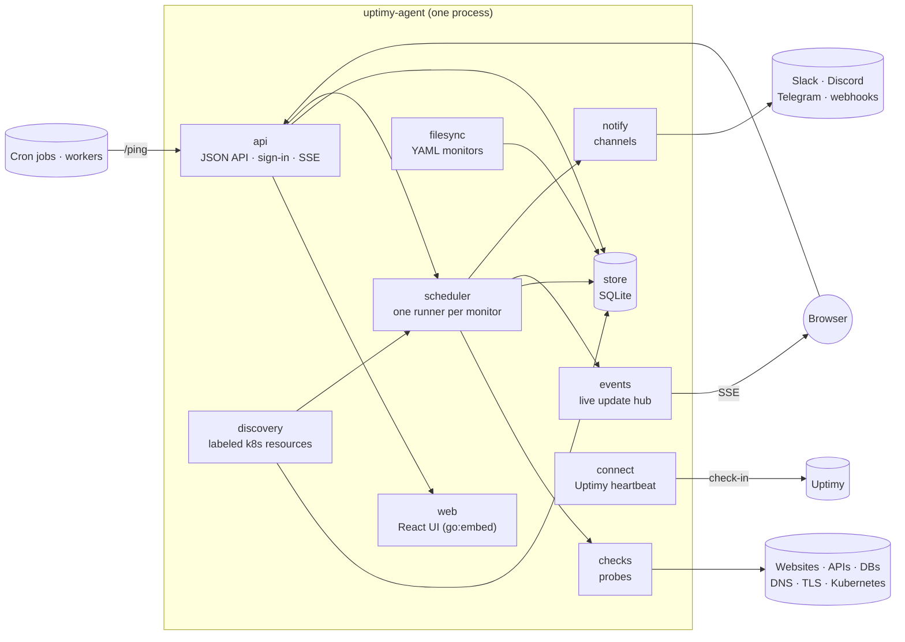

# Architecture

Uptimy Agent is one Go binary with an embedded React UI and a SQLite database. It's meant to run next to what it watches (in a Kubernetes cluster, a Railway project, a private network), so it has few dependencies and no required external services.

## Two kinds of monitor

A **monitor** is a healthcheck or a heartbeat (`internal/monitor`). Both have a name, a status (up, down, pending, paused), a place on the status page, events and alerts. What they track differs, so each kind has its own settings, history and pages:

| | Healthcheck | Heartbeat |
| --- | --- | --- |
| Who acts | the agent probes a target | a job pings the agent |
| Settings | `monitor.Check`: type, target, interval, timeout, threshold | `monitor.Heartbeat`: interval or cron + time zone, grace period, ping token |
| History | `results`: one row per probe, with latency | `runs`: one row per run, with its due time, start, finish, outcome and message |
| Measure | uptime and response time | on-time rate, missed and failed runs, duration |
| API | `/api/healthchecks` | `/api/heartbeats`, plus `/ping/<token>` for jobs |

In SQLite a `monitors` row holds what's shared, and a `healthchecks` or `heartbeats` row holds the rest.

## A healthcheck, end to end

1. On start, `cmd/uptimy-agent` opens the store, syncs monitors from the YAML file (`filesync`), and hands them all to the **scheduler**. Inside Kubernetes, `discovery` lists resources labeled `upti.my/monitor=true` every 30 seconds and hands what changed to the scheduler too. Both sync through `managed`: each source owns its monitors by name, and the API refuses to edit them. A discovered CronJob is a heartbeat whose runs `discovery/jobs.go` reads from its Jobs every 10 seconds and hands to the scheduler with `Scheduler.Report`, at the times Kubernetes recorded, instead of a ping.
2. The scheduler runs one goroutine per monitor. For a healthcheck it calls `checks.Run` on every interval, with the check's timeout.
3. `checks.Run` finds the check type's **probe** (registered by `internal/checks/<type>.go`) and returns an `Outcome`: OK, plus a message.
4. The scheduler stores the result and publishes it to the **events hub**, which streams it to open browsers over Server-Sent Events.
5. The healthcheck goes down after `failure_threshold` consecutive failures and up on the next success. Each change is recorded as an **event**; going down, and recovering from down, also sends an **alert** to every enabled notification channel.

## A heartbeat, end to end

1. The scheduler computes when the next run is due from the schedule and the last run (or the last edit, so pausing or rescheduling never causes an instant miss). The deadline is the due time plus the grace period.
2. The job calls `/ping/<token>`, optionally `/start` first, `/fail` or `/<exit code>` instead. `internal/api/ping.go` hands the ping to the heartbeat's goroutine, so pings are applied in order.
3. A finish closes the open run (from `/start`, which gives its duration) or records a new one: on time if it arrived by the deadline, a success or failure depending on the ping.
4. If nothing arrives by the deadline, a **missed** run is recorded. A late ping that arrives before the next due time still counts, as a late run.
5. Missed and failed runs take the heartbeat down; the next successful run brings it back up. As with healthchecks, each change is an event, and going down or recovering sends an alert.

## Alerts

An alert goes to the enabled channels that cover the monitor: those for every monitor, and those it's been added to (`store.NotifiersFor`). During a maintenance window covering the monitor, a down alert is held instead (`scheduler/maintenance.go`). When the window ends, a monitor that's still down alerts then; one that recovered sends nothing, since nobody heard it went down. Held alerts live in memory, so a restart during maintenance forgets them.

## Extension points

Check types and notification channels are registries, so a new one is self-contained (and if Uptime Kuma has it too, `internal/kuma/convert.go` maps it for importing):

| To add | Describe it in | Implement it in |
| --- | --- | --- |
| A check type | `internal/monitor/check_<type>.go` (`monitor.RegisterCheckType`): label, target, settings, validation | `internal/checks/<type>.go` (`register`): the probe |
| A notification channel | `internal/notify/<channel>.go` (`notify.Register`): label, settings, validation, and how to send | the same file |

Settings are described with `internal/schema.Field`. The API serves those descriptions (`/api/check-types`, `/api/notifier-types`) and the UI renders its forms from them, so new types need no frontend work. Tests check that every type has a probe, an example in `examples/monitors.yaml`, and a complete description. See [CONTRIBUTING.md](CONTRIBUTING.md) for a walk-through.

## Storage

SQLite through `modernc.org/sqlite` (pure Go, so the binary builds without cgo), with one connection in WAL mode: writes are serialized and reads never block them. Migrations are numbered SQL in `internal/store/store.go`, applied in order on start and recorded in `PRAGMA user_version`; an agent refuses to open a database written by a newer version.

### Where data lives

| What | Where | Model |
| --- | --- | --- |
| Users, sessions | `users`, `sessions` | `store.User` |
| Alert channels | `notifiers` | `notify.Notifier` |
| Healthchecks, heartbeats | `monitors` + `healthchecks` / `heartbeats` | `monitor.Monitor` |
| History | `results`, `runs`, `events` | `monitor.Result`, `monitor.Run`, `monitor.Event` |
| Alert routing | `notifiers.all_monitors` + `notifier_monitors` | `notify.Notifier` (`AllMonitors`, `MonitorIDs`) |
| Maintenance windows | `maintenance` + `maintenance_monitors` | `maintenance.Window` |
| Incidents | `incidents` + `incident_updates` + `incident_monitors` | `incident.Incident` |
| The status page's announcement | `settings` (JSON, apart from the page's settings) | `statuspage.Announcement` |
| API tokens (hashed) | `api_tokens` | `store.APIToken` |
| Status page settings and logos | `settings` (JSON) | `statuspage.Settings`, `statuspage.Logo` |
| Which monitors the status page shows, and how | columns on `monitors`, written only by the status page editor | `monitor.Monitor` (`Public`, `Status*`) |
| The Uptimy connection | `settings` (JSON) | `connect.Connection` |

Domain packages own the types and `internal/store` persists them; users, which only the store and sign-in use, are the exception. Settings rows are read and written only through typed methods (`StatusPage`, `SaveStatusPage`, `UptimyConnection`, ...), and their keys never leave the store. Changes that belong together (the page's settings and its layout, a connection and its check-in URL) are saved in one transaction.

Environment variables don't hold data. They set how the process runs (`PORT`, `DATA_DIR`, `RETENTION_DAYS`, ...) and three things that suit config better than a database:

- `ADMIN_PASSWORD` creates the first admin and resets that admin's password on every start (the recovery path). The UI won't change a password the environment sets.
- `UPTIMY_HEARTBEAT_URL` pins Watch the watcher, read-only in the UI, for agents without a persistent volume.
- `MONITORS_FILE` / `MONITORS_YAML` declare monitors. They're synced into the database on start, matched by name, and read-only in the UI.

## The UI

`web/` is React 19, Vite, Tailwind CSS and TanStack Query. `vite build` writes `web/dist`, which Go embeds; in production the agent serves the API and the UI on one port. In development (`make run`), the agent proxies the UI to a Vite dev server for hot reload, so you still use a single URL.

Live data comes from the SSE stream. Healthcheck results, which arrive constantly, are written straight into the query cache (`web/src/lib/liveCache.ts`), so a check updates the page without refetching. Heartbeat changes are rare, so they refetch what's on screen.

## Security model

- **Users** are admins or viewers. Every change needs an admin. Changes must be JSON (or, for imports, a raw file upload): types a cross-site form can't send without a CORS preflight, which the agent never grants. That blocks cross-site form posts.
- **API tokens** (`upa_…`) act as their user, read-only if chosen or if the user is a viewer. Only a SHA-256 hash is stored. Tokens can't manage accounts, users or tokens, so a leaked one can't lock you out or create more.
- **Credentials never reach viewers**: webhook URLs, auth headers, heartbeat ping tokens, database passwords and bot tokens are removed from anything a viewer can load, and masked wherever a target is shown (lists, alerts).
- **The public status page** shows names with uptime or on-time rate only, never targets, schedules or internal hostnames.
- **Ping URLs** are the only credential a job needs, so they're random (144 bits) and can be replaced from the heartbeat's page. A ping can only record a run for its own heartbeat.
- **Database targets** can read passwords from environment variables (`${VAR}`) so they aren't stored, but never the agent's own settings (`ADMIN_PASSWORD`, `UPTIMY_*`). Custom queries run read-only.
- **The Uptimy connection** uses an agent-scoped key that can only manage the agent's own heartbeat; it's kept on the server and revoked on disconnect.
- **Errors** are scrubbed of secrets before they're shown or logged (URLs with tokens, connection strings).

To report a vulnerability, see [SECURITY.md](SECURITY.md).
